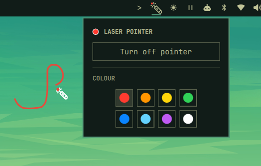

# Omarchy Laser Pointer

A laser pointer for presentations and screen sharing on Omarchy.



## Features

- Trail stays visible while left-click is held, then fades on release
- Recent strokes fade independently when a new stroke starts
- Laser head positioned at the pointer hotspot
- Hides the normal cursor while laser mode is on
- Eight presentation-friendly colors
- Adjustable trail thickness
- Multi-monitor support
- Captures left-clicks only while laser mode is on

## Use

- Left-click the laser icon in the Omarchy bar to open the controls.
- Choose a color and click **Turn on pointer**.
- Adjust the trail thickness with the slider.
- Right-click the laser icon to toggle laser mode quickly.
- Click **Turn off pointer** to restore the normal cursor.

## Interaction

When laser mode is on, the plugin captures left-clicks over the application
area so text selection, link activation, and other normal click actions do not
leak through. The Omarchy bar remains clickable, and opening the plugin popup
temporarily releases the application-area capture so its color controls and
thickness slider work normally.

No Hyprland bindings or configuration changes are required.

## Install

```bash
omarchy plugin add https://github.com/kvm404/omarchy-laser-pointer.git --enable
```

The plugin appears on the right side of the bar by default. To enable it in a
different section:

```bash
omarchy plugin enable io.github.kvm404.laser-pointer --section right
```

## Remove

```bash
omarchy plugin remove io.github.kvm404.laser-pointer
```

## License

MIT
